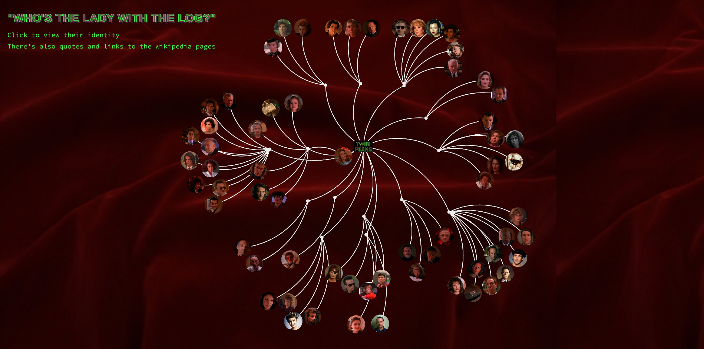

Few weeks ago, before I really dig into <a href="https://d3js.org/">D3.js</a>, I was building my first network graph with <a href="https://gephi.org/">Gephi</a> and [sigma.js](http://sigmajs.org/). But while the GUI and collecting the dataset was interesting enough, the Gephi didn't really support 4K resolution and this made me reconsider something more lightweight and interactive. From D3's gallery, I looked several force directed graph layouts and came up with something like this (notice: still under construction) after experimenting with the `JSON`:  

<a href="https://xtabentun.github.io/TwinPeaksGraph/">The whole graph can be seen here</a>

Basically, I started with the building of `JSON` schemas and properties (*keywords*) for each character and grouped them by the more or less ambiguous group attribute that I call here *location-families* (Such as *The Great Northern* or *Palmer's House*). At the same time I was building and testing the outlook locally, using simple NodeJS based `http-server`: [link](https://www.npmjs.com/package/http-server). While it may take some time to set the dataset, it is possible to make simple, yet interactive visualizations with D3.js relatively easily.

